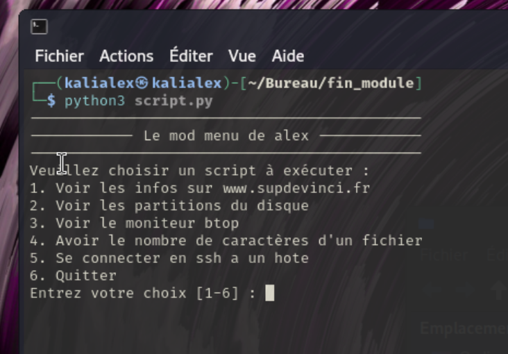

# Réalisation d'un mode menu en Linux et en Python dans le cadre du cours Linux
## Point d'entrée du mode menu :
Pour démmarrer le mode menu, j'ai fait un fichier script.py qui permet d'afficher le menu et de choisir une option parmis 8 fonctions :
##### 1 - Afficher les informations sur un domaine
##### 2 - Afficher les partitions du disque
##### 3 - Afficher un moniteur d'activité btop
##### 4 - Voir le nombre de caractères d'un fichier
##### 5 - Se connecter en SSH a un hote
##### 6 - Voir l'heure et la date a l'intant T
##### 7 - Faire un Ping sur un site Web
##### 8 - Quitter 

 ### Résultat de l'option 1 : 

 ### Résultat de l'option 2 : 

 ### Résultat de l'option 3 : 

 ### Résultat de l'option 4 : 

 ### Résultat de l'option 5 : 

 ### Résultat de l'option 6 : 

 ### Résultat de l'option 7 : 
